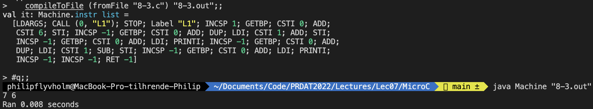
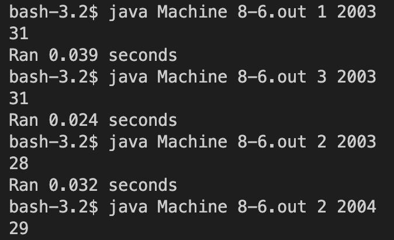

# Assignment 7

## Exercise 8.1

### (i)

#### Description
As a warm-up, compile one of the micro-C examples provided, such as that in source file ex11.c, then run it using the abstract machine implemented in Java, as described also in step (B) of the README file. When run with command line argument 8, the program prints the 92 solutions to the eight queens problem: how to place eight queens on a chessboard so that none of them can attack any of the others.

#### Solution
Running `java Machine ex11.out 8`


*(Full output could not be in picture but there was 92 lines)*

### (ii)
Now compile the example micro-C programs ex3.c and ex5.c using functions compileToFile and fromFile from ParseAndComp.fs as above.

Study the generated symbolic bytecode. Write up the bytecode in a more structured way with labels only at the beginning of the line (as in this chapter). Write the corresponding micro-C code to the right of the stack machine code. Note that ex5.c has a nested scope (a block { ... } inside a function body); how is that visible in the generated code?

```bash
compileToFile (fromFile "ex3.c") "ex3.out";;
val it: Machine.instr list =
  [LDARGS; CALL (1, "L1"); STOP; Label "L1"; INCSP 1; GETBP; CSTI 1; ADD;
   CSTI 0; STI; INCSP -1; GOTO "L3"; Label "L2"; GETBP; CSTI 1; ADD; LDI;
   PRINTI; INCSP -1; GETBP; CSTI 1; ADD; GETBP; CSTI 1; ADD; LDI; CSTI 1; ADD;
   STI; INCSP -1; INCSP 0; Label "L3"; GETBP; CSTI 1; ADD; LDI; GETBP; CSTI 0;
   ADD; LDI; LT; IFNZRO "L2"; INCSP -1; RET 0]
```
```bash
Compile ex3:
    LDARGS          # Adds arguments from command line to stack
    CALL(1,"L1")    # Calls main method
    STOP            # Stops program
L1:                 # void main(int n)
    INCSP 1         # int i
    GETBP           # Base pointer (part of get address of i)
    CSTI 1          # Local address of i (part of get address of i)
    ADD             # Add to get base pointer + local adress of i (part of get address of i)
    CASI 0          # 0
    STI             # Set i=0
    INCSP -1        # Remove side-effect from STI
    GOTO "L3"       # while (i < n)
L2:
    GETBP           # Base pointer (part of get address of i)
    CSTI 1          # Local address of i (part of get address of i)
    ADD             # Add to get base pointer + local adress of i (part of get address of i)
    LDI             # Get value of i at adress
    PRINTI          # print i;
    INCSP -1        # remove value from stack
    GETBP           # Base pointer (part of get address of i)
    CSTI 1          # Local address of i (part of get address of i)
    ADD             # Add to get base pointer + local adress of i (part of get address of i)
    GETBP           # Base pointer (part of get address of i)
    CSTI 1          # Local address of i (part of get address of i)
    ADD             # Add to get base pointer + local adress of i (part of get address of i)
    LDI             # Load value of i at address
    CSTI 1          # constant 1
    ADD             # i + 1
    STI             # i = i + 1
    INCSP -1        # Remove side-effect of STI
    INCSP 0         # Since no return then it will continue down to L3
L3:                 # while (i < n)
    GETBP           # Base pointer (part of get address of i)
    CSTI 1          # Local address of i (part of get address of i)
    ADD             # Add to get base pointer + local adress of i (part of get address of I)
    LDI             # Load value of i at address
    GETBP           # Base pointer (part of get address of n)
    CSTI 0          # Local address of n (part of get address of n)
    ADD             # Add to get base pointer + local adress of n (part of get adress of n)
    LDI             # Load value of n at address
    LT              # Less than i < n
    IFNZRO L2       # if i < n then goto L2 else continue
    INCSP -1        # Shrink stack by 1
    RET 0           # Return main. 0 since void
```
```bash
> compileToFile (fromFile "ex5.c") "ex5.out";;
val it: Machine.instr list =
  [LDARGS; CALL (1, "L1"); STOP; Label "L1"; INCSP 1; GETBP; CSTI 1; ADD;
   GETBP; CSTI 0; ADD; LDI; STI; INCSP -1; INCSP 1; GETBP; CSTI 0; ADD; LDI;
   GETBP; CSTI 2; ADD; CALL (2, "L2"); INCSP -1; GETBP; CSTI 2; ADD; LDI;
   PRINTI; INCSP -1; INCSP -1; GETBP; CSTI 1; ADD; LDI; PRINTI; INCSP -1;
   INCSP -1; RET 0; Label "L2"; GETBP; CSTI 1; ADD; LDI; GETBP; CSTI 0; ADD;
   LDI; GETBP; CSTI 0; ADD; LDI; MUL; STI; INCSP -1; INCSP 0; RET 1]
```
```bash
Compile ex5:
    LDARGS          # Adds arguments from command line to stack
    CALL(1,"L1")    # Calls main method
    STOP            # Stops program
L1:                 # void main(int n)
    INCSP 1         # int r;
    GETBP           # Base pointer (part of get address of r)
    CSTI 1          # Local address of r (part of get address of r)
    ADD             # Add to get base pointer + local address of r (part of get address of r)
    GETBP           # Base pointer (part of get address of n)
    CSTI 0          # Local address of n (part of get address of n)
    ADD             # Add to get base pointer + local address of n (part of get address of n)
    LDI             # Load value of n from stack
    STI             # Store value of n at r address (r = n;)
    INCSP -1        # Remove side-effect of STI
    INCSP 1         # int r in block (line 7)  <!! START OF BLOCK>
    GETBP           # Base pointer (part of get address of n)
    CSTI 0          # Local address of n (part of get address of n)
    ADD             # Add to get base pointer + local address of n (part of get address of n)
    LDI             # Load value of n from stack
    GETBP           # Base pointer (part of get address of r)
    CSTI 2          # Local address of blocked r (part of get address of blocked r)
    ADD             # Add to get base pointer + local address of blocked r (part of get address of blocked r)
    CALL (2, "L2")  #sqaure(n, &r)
    INCSP -1        # Remove side-effect of call 
    GETBP           # Base pointer (part of get address of r)
    CSTI 2          # Local address of r (part of get address of r)
    ADD             # Add to get base pointer + local address of r (part of get address of r)
    LDI             # Get value of r
    PRINTI          # print r; (line 9)
    INCSP -1        # Remove r value from stack
    INCSp -1        # Remove r from stack <!! END OF BLOCK>
    GETBP           # Base pointer (part of get address of r)
    CSTI 1          # Local address of r (part of get address of r)
    ADD             # Add to get base pointer + local address of r (part of get address of r)
    LDI             # Get value of r
    PRINTI          # print r; (line 11)
    INCSP -1        # Remove n from stack
    INCSP -1        # Remove n from stack
    RET 0
L2:                 #void sqaure(int i, int *rp)
    GETBP           # Base pointer (part of get address of rp)
    CSTI 1          # Local address of rp (part of get address of rp)
    ADD             # Add to get base pointer + local adress of rp (part of get address of rp)
    LDI             # Load value *rp to stack
    GETBP           # Base pointer (part of get address of i)
    CSTI 0          # Local address of i (part of get address of i)
    ADD             # Add to get base pointer + local adress of i (part of get address of i)
    LDI             # Load i to stack
    GETBP           # Base pointer (part of get address of i)
    CSTI 0          # Local address of i (part of get address of i)
    ADD             # Add to get base pointer + local adress of i (part of get address of i)
    LDI             # Load i to stack
    MUL             # Multiply previous two stack elements i * i
    STI             # Store i*i at *rp (*rp = i * i;)
    INCSP -1        # Remove side-effects of STI
    INCSP 0
    RET 1
```
*^ The block is located at between the `<!! START OF BLOCK>` and `<!! END OF BLOCK>`*

Trace the execution using java Machinetrace ex3.out 4, and explain the stack contents and what goes on in each step of execution, and especially how the low-level bytecode instructions map to the higher-level features of micro-C. You can capture the standard output from a command prompt (in a file ex3trace.txt) using the Unix-style notation:
`java Machinetrace ex3.out 4 > ex3trace.txt`
Output of trace:
```bash
[ ]                  {0: LDARGS}     # Arg n given 4 and set in stack
[ 4 ]                {1: CALL 1 5}   # Call main and add n as a local variable
[ 4 -999 4 ]         {5: INCSP 1}    # int i
[ 4 -999 4 0 ]       {7: GETBP}      # main base pointer
[ 4 -999 4 0 2 ]     {8: CSTI 1}     # Add address of i to stack
[ 4 -999 4 0 2 1 ]   {10: ADD}       # Convert to global address
[ 4 -999 4 0 3 ]     {11: CSTI 0}    # Add literal 0 to stack
[ 4 -999 4 0 3 0 ]   {13: STI}       # Set value at address 3 to 0
[ 4 -999 4 0 0 ]     {14: INCSP -1}  # Remove side-effect
[ 4 -999 4 0 ]       {16: GOTO 43}   # Start while
[ 4 -999 4 0 ]       {43: GETBP}     # main base pointer
[ 4 -999 4 0 2 ]     {44: CSTI 1}    # Add address of i to stack
[ 4 -999 4 0 2 1 ]   {46: ADD}       # Convert to global address
[ 4 -999 4 0 3 ]     {47: LDI}       # Get value of i (0)
[ 4 -999 4 0 0 ]     {48: GETBP}     # Main base pointer
[ 4 -999 4 0 0 2 ]   {49: CSTI 0}    # Add address of n to stack
[ 4 -999 4 0 0 2 0 ] {51: ADD}       # convert to global address
[ 4 -999 4 0 0 2 ]   {52: LDI}       # Get value of n (4)
[ 4 -999 4 0 0 4 ]   {53: LT}        # i < n (0 < 4 == 1)
[ 4 -999 4 0 1 ]     {54: IFNZRO 18} # It tis true so we run while code
[ 4 -999 4 0 ]       {18: GETBP}     # Main base pointer
[ 4 -999 4 0 2 ]     {19: CSTI 1}    # Add address of i to stack
[ 4 -999 4 0 2 1 ]   {21: ADD}       # Convert to global address
[ 4 -999 4 0 3 ]     {22: LDI}       # Get value of i (0)
[ 4 -999 4 0 0 ]     {23: PRINTI}    # print i;
0 [ 4 -999 4 0 0 ]   {24: INCSP -1}  # Remove side-effect
[ 4 -999 4 0 ]       {26: GETBP}     # <
[ 4 -999 4 0 2 ]     {27: CSTI 1}    # | Get address of i
[ 4 -999 4 0 2 1 ]   {29: ADD}       # >
[ 4 -999 4 0 3 ]     {30: GETBP}     # < 
[ 4 -999 4 0 3 2 ]   {31: CSTI 1}    # | Get value of i 
[ 4 -999 4 0 3 2 1 ] {33: ADD}       # |
[ 4 -999 4 0 3 3 ]   {34: LDI}       # >
[ 4 -999 4 0 3 0 ]   {35: CSTI 1}    # Add literal 1 to stack
[ 4 -999 4 0 3 0 1 ] {37: ADD}       # i+1
[ 4 -999 4 0 3 1 ]   {38: STI}       # i = i+1
[ 4 -999 4 1 1 ]     {39: INCSP -1}  # Remove side-effect of STI
[ 4 -999 4 1 ]       {41: INCSP 0}   # <
[ 4 -999 4 1 ]       {43: GETBP}     # | Bytecode to check if i < n
[ 4 -999 4 1 2 ]     {44: CSTI 1}    # | But now i is 1
[ 4 -999 4 1 2 1 ]   {46: ADD}       # |
[ 4 -999 4 1 3 ]     {47: LDI}       # |
[ 4 -999 4 1 1 ]     {48: GETBP}     # |
[ 4 -999 4 1 1 2 ]   {49: CSTI 0}    # |
[ 4 -999 4 1 1 2 0 ] {51: ADD}       # |
[ 4 -999 4 1 1 2 ]   {52: LDI}       # |
[ 4 -999 4 1 1 4 ]   {53: LT}        # |
[ 4 -999 4 1 1 ]     {54: IFNZRO 18} # >
[ 4 -999 4 1 ]       {18: GETBP}     # <
[ 4 -999 4 1 2 ]     {19: CSTI 1}    # | Bytecode to run
[ 4 -999 4 1 2 1 ]   {21: ADD}       # | print i;
[ 4 -999 4 1 3 ]     {22: LDI}       # | i = i+1;
[ 4 -999 4 1 1 ]     {23: PRINTI}    # | 
1 [ 4 -999 4 1 1 ]   {24: INCSP -1}  # |
[ 4 -999 4 1 ]       {26: GETBP}     # | But with the difference:
[ 4 -999 4 1 2 ]     {27: CSTI 1}    # | i = 1
[ 4 -999 4 1 2 1 ]   {29: ADD}       # | i will be 2 when done
[ 4 -999 4 1 3 ]     {30: GETBP}     # |
[ 4 -999 4 1 3 2 ]   {31: CSTI 1}    # |
[ 4 -999 4 1 3 2 1 ] {33: ADD}       # |
[ 4 -999 4 1 3 3 ]   {34: LDI}       # |
[ 4 -999 4 1 3 1 ]   {35: CSTI 1}    # |
[ 4 -999 4 1 3 1 1 ] {37: ADD}       # |
[ 4 -999 4 1 3 2 ]   {38: STI}       # |
[ 4 -999 4 2 2 ]     {39: INCSP -1}  # >
[ 4 -999 4 2 ]       {41: INCSP 0}   # <
[ 4 -999 4 2 ]       {43: GETBP}     # | Bytecode to check if i < n
[ 4 -999 4 2 2 ]     {44: CSTI 1}    # | But i is 2
[ 4 -999 4 2 2 1 ]   {46: ADD}       # |
[ 4 -999 4 2 3 ]     {47: LDI}       # |
[ 4 -999 4 2 2 ]     {48: GETBP}     # |
[ 4 -999 4 2 2 2 ]   {49: CSTI 0}    # |
[ 4 -999 4 2 2 2 0 ] {51: ADD}       # |
[ 4 -999 4 2 2 2 ]   {52: LDI}       # |
[ 4 -999 4 2 2 4 ]   {53: LT}        # |
[ 4 -999 4 2 1 ]     {54: IFNZRO 18} # >
[ 4 -999 4 2 ]       {18: GETBP}     # <
[ 4 -999 4 2 2 ]     {19: CSTI 1}    # |Bytecode to run 
[ 4 -999 4 2 2 1 ]   {21: ADD}       # |print i;
[ 4 -999 4 2 3 ]     {22: LDI}       # |i = i+1;
[ 4 -999 4 2 2 ]     {23: PRINTI}    # |
[ 4 -999 4 1 1 ]     {23: PRINTI}    # | 
2 [ 4 -999 4 2 2 ]   {24: INCSP -1}  # |But with the difference
[ 4 -999 4 2 ]       {26: GETBP}     # |i = 2
[ 4 -999 4 2 2 ]     {27: CSTI 1}    # |i will be 3 when done
[ 4 -999 4 2 2 1 ]   {29: ADD}       # |
[ 4 -999 4 2 3 ]     {30: GETBP}     # |
[ 4 -999 4 2 3 2 ]   {31: CSTI 1}    # |
[ 4 -999 4 2 3 2 1 ] {33: ADD}       # |
[ 4 -999 4 2 3 3 ]   {34: LDI}       # |
[ 4 -999 4 2 3 2 ]   {35: CSTI 1}    # |
[ 4 -999 4 2 3 2 1 ] {37: ADD}       # |
[ 4 -999 4 2 3 3 ]   {38: STI}       # |
[ 4 -999 4 3 3 ]     {39: INCSP -1}  # >
[ 4 -999 4 3 ]       {41: INCSP 0}   # <
[ 4 -999 4 3 ]       {43: GETBP}     # | Bytecode to check if i < n
[ 4 -999 4 3 2 ]     {44: CSTI 1}    # | But i is 3
[ 4 -999 4 3 2 1 ]   {46: ADD}       # |
[ 4 -999 4 3 3 ]     {47: LDI}       # |
[ 4 -999 4 3 3 ]     {48: GETBP}     # |
[ 4 -999 4 3 3 2 ]   {49: CSTI 0}    # |
[ 4 -999 4 3 3 2 0 ] {51: ADD}       # |
[ 4 -999 4 3 3 2 ]   {52: LDI}       # |
[ 4 -999 4 3 3 4 ]   {53: LT}        # |
[ 4 -999 4 3 1 ]     {54: IFNZRO 18} # >
[ 4 -999 4 3 ]       {18: GETBP}     # <
[ 4 -999 4 3 2 ]     {19: CSTI 1}    # |Bytecode to run 
[ 4 -999 4 3 2 1 ]   {21: ADD}       # |print i;
[ 4 -999 4 3 3 ]     {22: LDI}       # |i = i+1;
[ 4 -999 4 3 3 ]     {23: PRINTI}    # |
3 [ 4 -999 4 3 3 ]   {24: INCSP -1}  # | 
[ 4 -999 4 3 ]       {26: GETBP}     # |But with the difference
[ 4 -999 4 3 2 ]     {27: CSTI 1}    # |i = 3
[ 4 -999 4 3 2 1 ]   {29: ADD}       # |i will be 4 when done
[ 4 -999 4 3 3 ]     {30: GETBP}     # |
[ 4 -999 4 3 3 2 ]   {31: CSTI 1}    # |
[ 4 -999 4 3 3 2 1 ] {33: ADD}       # |
[ 4 -999 4 3 3 3 ]   {34: LDI}       # |
[ 4 -999 4 3 3 3 ]   {35: CSTI 1}    # |
[ 4 -999 4 3 3 3 1 ] {37: ADD}       # |
[ 4 -999 4 3 3 4 ]   {38: STI}       # |
[ 4 -999 4 4 4 ]     {39: INCSP -1}  # >
[ 4 -999 4 4 ]       {41: INCSP 0}   # <
[ 4 -999 4 4 ]       {43: GETBP}     # | Bytecode to check if i < n
[ 4 -999 4 4 2 ]     {44: CSTI 1}    # | But i is 4
[ 4 -999 4 4 2 1 ]   {46: ADD}       # |
[ 4 -999 4 4 3 ]     {47: LDI}       # |
[ 4 -999 4 4 4 ]     {48: GETBP}     # |
[ 4 -999 4 4 4 2 ]   {49: CSTI 0}    # |
[ 4 -999 4 4 4 2 0 ] {51: ADD}       # |
[ 4 -999 4 4 4 2 ]   {52: LDI}       # |
[ 4 -999 4 4 4 4 ]   {53: LT}        # |
[ 4 -999 4 4 0 ]     {54: IFNZRO 18  # Since i is 4 and therefor not i < n then it will not run inner while again>
[ 4 -999 4 4 ]       {56: INCSP -1}  # Remove side-effect from LT
[ 4 -999 4 ]         {58: RET 0}     # void so no return
[ 4 ]                {4: STOP}       # STOP Program
```

## Exercise 8.3

### Description

Modify the compiler (function cExpr) to generate code for PreInc(acc) and PreDec(acc). To parse micro-C source programs containing these expressions, you also need to modify the lexer and parser.

### Solution

Added cases for PreInc and PreDec In Comp.fs
```
cExpr ...
| ...
| PreInc acc -> cAccess acc varEnv funEnv @ [DUP; LDI; CSTI 1; ADD; STI]
| PreDec acc -> cAccess acc varEnv funEnv @ [DUP; LDI; CSTI 1; SUB; STI]
```
To test it we created the following program
```
void main() {
    int num;
	num = 6;
	
	++num;
    print num;
	
	--num;
    print num;
}
```
which prints 7 6 which is the correct answer


## Exercise 8.4

### Description

**Compile ex8.c and study the symbolic bytecode to see why it is so much slower than the handwritten 20 million iterations loop in prog1.**

Using the table from the slides then Prog1 can be decompilled to
```
CSTI 20000000
GOTO 7 
CSTI 1 
SUB
DUP
IFNZERO 4 
STOP
```
While ex8 will be compiled with Compile to:

```
LDARGS;
CALL (0, "L1");
STOP;
Label "L1";
    INCSP 1;
    GETBP;
    CSTI 0;
    ADD;
    CSTI 20000000;
    STI;
    INCSP -1;
    GOTO "L3";
Label "L2";
    GETBP;
    CSTI 0;
    ADD;
    GETBP; 
    CSTI 0; 
    ADD; 
    LDI; 
    CSTI 1; 
    SUB; STI; 
    INCSP -1; 
    INCSP 0; 
    Label "L3";
    GETBP; 
    CSTI 0; 
    ADD; 
    LDI; 
    IFNZRO "L2"; 
    INCSP -1; 
    RET -1
```
Here we can easily see that the current value of the original 20.000.000 is always on top of stack in prog1 and therefore there is no need to find the current value in memory since we can always assume it is either the newest or second newest element in the stack.

**Compile ex13.c and study the symbolic bytecode to see how loops and condi- tionals interact; describe what you see.**

`ex13.c` compiles to:
```bash
LDARGS;
CALL (1, "L1");
STOP; 

Label "L1"; 
    INCSP 1; 
    GETBP; 
    CSTI 1; 
    ADD;
    CSTI 1889; 
    STI; 
    INCSP -1; 
    GOTO "L3"; 
Label "L2"; 
    GETBP; 
    CSTI 1; 
    ADD; 
    GETBP;
    CSTI 1; 
    ADD; 
    LDI;
    CSTI 1;
    ADD; 
    STI; 
    INCSP -1; 
    GETBP; 
    CSTI 1; 
    ADD; 
    LDI;
    CSTI 4; 
    MOD; 
    CSTI 0; 
    EQ; 
    IFZERO "L7"; 
    GETBP; 
    CSTI 1; 
    ADD; 
    LDI; 
    CSTI 100;
    MOD; 
    CSTI 0; 
    EQ; 
    NOT; 
    IFNZRO "L9"; 
    GETBP; 
    CSTI 1; 
    ADD; 
    LDI; 
    CSTI 400; 
    MOD;
    CSTI 0; 
    EQ; 
    GOTO "L8"; 

Label "L9"; 
    CSTI 1; 

Label "L8"; 
    GOTO "L6";

Label "L7"; 
    CSTI 0; 

Label "L6"; 
    IFZERO "L4";
    GETBP; 
    CSTI 1; 
    ADD; 
    LDI;
    PRINTI; 
    INCSP -1; 
    GOTO "L5"; 

Label "L4"; 
    INCSP 0; 

Label "L5"; 
    INCSP 0;

Label "L3"; 
    GETBP; 
    CSTI 1; 
    ADD; 
    LDI; 
    GETBP; 
    CSTI 0; 
    ADD; 
    LDI; 
    LT;
    IFNZRO "L2"; 
    INCSP -1; 
    RET 0
```
As seen above then ex13 generates a lot of labels. Some of the labels come from like L1, L2 and L3 come from function declarations and while loop logic while the rest come from the if statement which uses `&&`, `||` and brackets. Since if the right side of `&&` is false then it will just return false from there.

## Exercise 8.5

### Description

Extend the micro-C language, the abstract syntax, the lexer, the parser, and the compiler to implement conditional expressions of the form (e1 ? e2 : e3).
The compilation of e1 ? e2 : e3 should produce code that evaluates e2 only if e1 is true and evaluates e3 only if e1 is false. The compilation scheme should be the same as for the conditional statement if (e1) e2 else e3, but expression e2 or expression e3 must leave its value on the stack top if evaluated, so that the entire expression e1 ? e2 : e3 leaves its value on the stack top.

### Solution

First we start in `CPar.fsy` and add tokens `QUESTIONMARK` and `COLON` 
```f#
%token CHAR ELSE IF QUESTIONMARK COLON INT NULL PRINT PRINTLN RETURN VOID WHILE FOR
```
and we also add an case for the ShortIf (ternary) expression in the expr match statement
```f#
| LPAR Expr QUESTIONMARK Expr COLON Expr RPAR { ShortIf($2, $4, $6) }
```
afterwards we move to `CLex.fsl` and add tokens for `?` and `:`
```f#
| '?'             { QUESTIONMARK }
| ':'             { COLON }
```
Lastly we add to `Comp.fs` code to compile the ShortIf
```f#
| ShortIf (e, expr1, expr2) -> 
      let labelse = newLabel()
      let labend  = newLabel()
      cExpr e varEnv funEnv @ [IFZERO labelse] 
      @ cExpr expr1 varEnv funEnv @ [GOTO labend]
      @ [Label labelse] @ cExpr expr2 varEnv funEnv
      @ [Label labend]
```
We can test it with the following code:
```c
void main() {
    int num;
    print (1 < 2 ? 2 : 3);
    num = (true ? (5) : (6));
    print num;
	num = (false ? 5 : 6);
    print num;
}
```
Which should print `2 5 6` 


## Exercise 8.6

### Description

Extend the lexer, parser, abstract syntax and compiler to implement switch statements such as this one:
```c
switch (month) {
  case 1:
    { days = 31; }
  case 2:
References 153
    { days = 28; if (y%4==0) days = 29; }
  case 3:
{ days = 31; } }
```
Unlike in C, there should be no fall-through from one case to the next: after the last statement of a case, the code should jump to the end of the switch statement. The parenthesis after switch must contain an expression. The value after a case must be an integer constant, and a case must be followed by a statement block. A switch with n cases can be compiled using n labels, the last of which is at the very end of the switch. For simplicity, do not implement the break statement or the default branch.

### Solution

To implement the switch statement then we start in `CLex.fsl` and add the strings `switch` and `case` and match them to `SWITCH` and `CASE`. Afterwards we add SWITCH and CASE to the tokens in `CPar.fsy`. In the same file we add to the StmtM match case
```f#
StmtM
| SWITCH LPAR Expr RPAR LBRACE CaseL RBRACE { Switch($3, $6) }
```

and add an `CaseL` match case
```f#
CaseL:
    CASE CSTINT COLON Stmt               { [($2, $4)]}
  | CASE CSTINT COLON Stmt CaseL         { ($2, $4) :: $5}
```

This is compiled in `Comp.fs`
```f#
| Switch (expr, cases) ->
      let labelend = newLabel();
      let caseLabels = List.map (fun (i, stmt) -> (i, stmt, newLabel())) cases;

      let e = cExpr expr varEnv funEnv
      List.fold (
        fun acc (i, stmt, label) ->
          e
          @ [CSTI i]
          @ [EQ]
          @ [IFNZRO label]
          @ acc
      ) [] caseLabels
      @ List.fold (
        fun acc (i, stmt, label) -> 
          [Label label]
          @ cStmt stmt varEnv funEnv
          @ [GOTO labelend]
          @ acc
        ) [] caseLabels
      @ [Label labelend]
```

We test it with
```c
void main(int month, int year) {
    int days;
    switch (month) {
        case 1:
            { days = 31; }
        case 2:
            { days = (year%4==0 ? 29 : 28); }
        case 3:
            { days = 31; } 
    }
    print days;
}
```
Which should print 31 if month is 1 or 3 and 28 if month is 2, unless year can be divided fully by 4, in which case it is 29.

